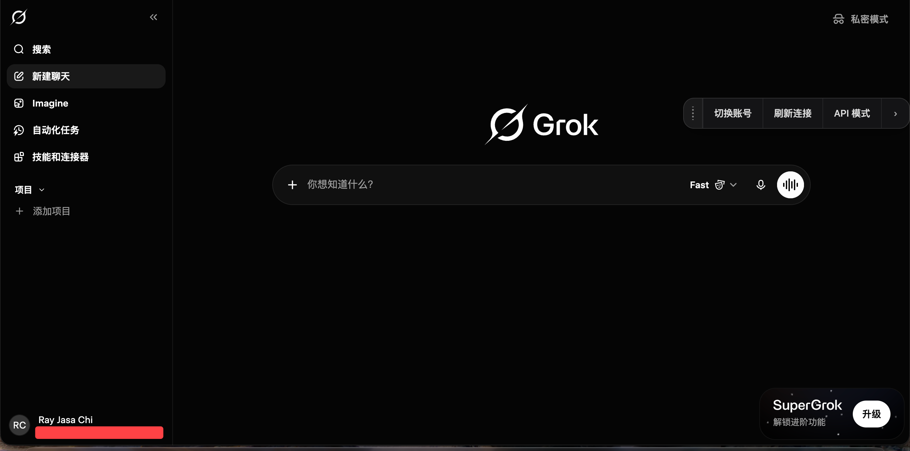
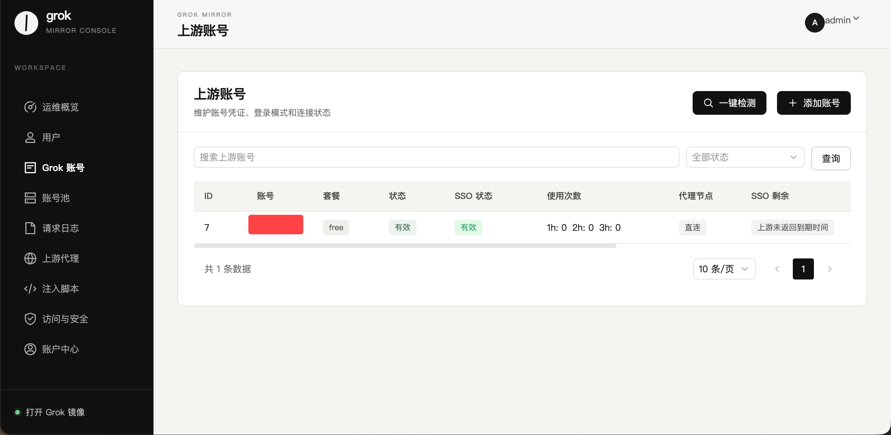

# Grok Mirror

一个面向个人与小型团队的 Grok Web 镜像管理项目，提供接近官方网页端的使用体验，以及用户、上游账号、账号池、访问策略和运行日志等管理能力。

> 本项目是独立的社区项目，与 xAI 或 Grok 官方无隶属、合作或背书关系。

## 功能概览

- 接近 Grok 网页端的对话与图片使用体验
- 管理员与普通用户分权管理
- 通过 SSO Cookie 维护上游账号，无需保存上游账号密码
- 上游账号状态检测、账号池与切换能力
- 多个镜像用户之间的普通对话隔离
- 可配置开放注册、免费入口与 Cloudflare Turnstile 人机验证
- 请求日志、代理节点、注入脚本与访问路径管理
- 支持桌面端与移动端浏览器
- Docker Compose 部署，数据目录持久化

项目包含维持上游连接所需的转发与连接辅助服务；本文仅介绍公开部署和使用方式，不展开内部实现。

## 界面预览

### Grok 使用界面



### 管理控制台



> 截图中的账号名称等信息已做遮挡处理，实际界面可能随上游页面更新而变化。

## 快速开始

### 环境要求

- Linux 服务器，推荐 `1 vCPU / 1.5-2 GB RAM` 或更高配置
- Docker Engine 24+
- Docker Compose v2
- 一个可用域名及 HTTPS 证书（公网部署时强烈建议）
- 合法、有效且由你本人或你的组织授权使用的 Grok SSO Cookie

### 1. 获取项目

```bash
git clone https://github.com/Jasa-Chi-Ray/grok-mirror.git
cd grok-mirror
```

### 2. 准备环境变量

```bash
cp .env.example .env
```

打开 `.env`，至少替换管理员密码、Django 密钥、凭据加密密钥和内部服务鉴权密钥。
不要把填写后的 `.env`、SSO Cookie、日志或数据库提交到 GitHub。

### 3. 启动服务


```bash
docker compose pull && docker compose up -d
```


查看运行状态：

```bash
docker compose ps
docker compose logs -f --tail=200
```

默认访问地址：

```text
http://服务器地址:41002/
```

公网环境建议由 Nginx、Caddy 或 Cloudflare 统一提供 HTTPS，并将流量转发到 `41002` 端口。

## 环境变量

完整模板见 [`.env.example`](.env.example)。常用配置如下：

| 变量 | 必填 | 默认值 | 说明 |
| --- | --- | --- | --- |
| `PORT` | 否 | `41002` | 对外服务端口 |
| `ADMIN_USERNAME` | 否 | `admin` | 初始管理员用户名 |
| `ADMIN_PASSWORD` | 是 | 无 | 初始管理员密码，请使用强密码 |
| `DJANGO_SECRET_KEY` | 是 | 无 | Web 会话与签名密钥，建议至少 32 字节 |
| `CREDENTIAL_ENCRYPTION_KEY` | 是 | 无 | 敏感凭据加密密钥，部署后请妥善备份且不要随意更换 |
| `DJANGO_ALLOWED_HOSTS` | 公网部署时 | 本地地址 | 允许访问后台的域名列表，多个值使用逗号分隔 |
| `DJANGO_CSRF_TRUSTED_ORIGINS` | 公网部署时 | 空 | 可信 HTTPS 来源，例如 `https://grok.example.com` |
| `DJANGO_CSRF_COOKIE_SECURE` | 否 | `true` | 是否仅通过 HTTPS 发送 CSRF Cookie |
| `ALLOW_REGISTER` | 否 | `false` | 是否允许访客自行注册 |
| `CLOUDFLARE_TURNSTILE` | 否 | `disable` | 登录/注册页人机验证，可设为 `enable` |
| `CLOUDFLARE_TURNSTILE_SITE_KEY` | 启用验证时 | 空 | Turnstile Site Key |
| `CLOUDFLARE_TURNSTILE_SECRET_KEY` | 启用验证时 | 空 | Turnstile Secret Key |

内部服务鉴权密钥同样是必填项，变量名与示例已写在 `.env.example` 中。除非你明确了解影响，否则保持其余配置为默认值。


如果仅通过 HTTP 在本地测试，可按实际情况将安全 Cookie 相关选项设为 `false`；公网环境不要这样配置。

## 首次使用

1. 打开 `https://你的域名/`，使用 `.env` 中设置的管理员账号登录。
2. 进入“上游账号”，点击“添加账号”。
3. 填入完整有效的 SSO Cookie，并保存。
4. 使用“一键检测”确认账号当前可用。
5. 按需建立账号池，并为用户分配可用账号或使用策略。
6. 从控制台左下角进入 Grok 镜像页面，开始使用。

SSO Cookie 等同于登录凭据。请只在你完全信任的服务器上使用，并限制管理后台的访问范围。

## 数据与备份

Docker Compose 会将运行数据保存在项目目录下的持久化目录中。升级、迁移或调整加密密钥前，请先备份：

```bash
tar -czf grok-mirror-backup.tar.gz data backend/db backend/logs .env
```

备份文件可能包含账号信息、会话数据、日志和密钥，必须加密保存，不能公开上传。

恢复时应同时恢复原 `.env`，尤其是凭据加密密钥；否则已经保存的敏感数据可能无法解密。

执行更新前请先备份持久化数据和 `.env`。


## 参与贡献

欢迎通过 Issue 提交可复现的问题

提交问题时建议附上：

- 部署方式与项目版本
- 操作系统、浏览器和设备信息
- 可复现步骤
- 失败请求的 URL、方法、状态码和响应摘要
- 已脱敏的日志或截图

请确保所有凭据、Cookie、密钥、域名、IP、用户信息与会话内容均已脱敏。

## 免责声明

本项目仅用于学习、研究与自托管场景。使用者应自行确认其使用方式符合所在地法律法规、xAI/Grok 的服务条款以及相关第三方服务条款。

Grok、xAI 及相关名称和标识归其各自权利人所有。本项目不保证上游服务的持续可用性，也不承诺在上游页面、接口或风控策略变更后始终可用。使用本项目产生的账号限制、数据损失、服务中断或其他风险由部署者和使用者自行承担。
